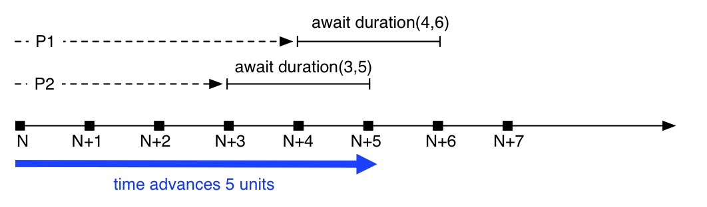

.. _sec:timed-abs:

*********
Timed ABS
*********

Timed ABS is an extension to the core ABS language that introduces a
notion of *abstract time*.  Timed ABS can be used to model not only
the functional behavior but also the timing-related behavior of real
systems running on real hardware.  In contrast to real systems, time
in an ABS model does not advance by itself.  The time model of Timed
ABS takes inspiration from formalisms such as `Timed Automata
<http://uppaal.org>`__ and `Real-Time Maude
<http://heim.ifi.uio.no/~peterol/RealTimeMaude/>`__.

The ABS notion of time is *dense time* with *run-to-completion semantics*.
Timed ABS adds a clock to the language semantics that advances in response to
certain language constructs.  Time is expressed as a rational number, so the
clock can advance in infinitesimally small steps.

.. note:: All untimed ABS models are valid in Timed ABS.  An ABS model
          that contains no time-influencing statements will run
          without influencing the clock and will finish at time zero.

It is possible to assign *deadlines* to method calls.  Deadlines are expressed
in terms of a duration value relative to the current time and decrease as the
clock advances.  The current deadline of a method is available via the
function ``deadline`` and decreases down to zero.

Semantics of Time Advancement
=============================

Time only advances when all processes are blocked or suspended and no process
is ready to run.  This means that for time to advance, all processes are in
one of the following states:

* the process is awaiting for a guard that is not enabled (see
  :ref:`await-stmt`)
* the process is blocked on a future that is not available (see
  :ref:`get-expression`)
* the process is suspended waiting for time to advance
* the process is waiting for some resources

In practice this means that all processes run as long as there is
“work to be done.”

The simulated clock advances such that it makes the least amount of
“jumps” without missing any point of interest.  This means that when a
process waits or blocks for an interval *(min, max)*, the clock will
not advance more than *max*, since otherwise it would miss unblocking
the process.  On the other hand, the clock will advance by the highest
amount allowed by the model.  This means that if only one process
waits for *(min, max)*, the clock will advance by *max*.

.. _fig-time-advance:

   Big-step time advance

Figure :ref:`fig-time-advance` shows a timeline with two process,
``P1`` and ``P2``.  At time :math:`N`, both suspend themselves waiting
for time advance: ``P1`` waits for :math:`4-6` time units, ``P2``
waits for :math:`3-5` units, respectively.  Assuming that no other
process is ready to run, the clock will advance the maximum amount
that still hits the earliest interval, in this case 5.  Since the
clock is now within both requested intervals, both processes are
unblocked and ready to run.

Datatypes and Constructors
==========================

Time is expressed as a datatype ``Time``, durations are expressed
using the datatype ``Duration``, which can be infinite.  These
datatypes are defined in the standard library as follows::

  data Time = Time(Rat timeValue);
  data Duration = Duration(Rat durationValue) | InfDuration;

Functions
=========

now
---

The function ``now`` always returns the current time::

  def Time now()
  => Time(0)

Note that since ABS uses simulated time, two calls to ``now`` can
return the same value.  Specifically, the result of ``now()`` changes
only by executing ``duration`` or ``await duration`` statements, or by
waiting for resources to become available::

  Time t1 = now();
  Int i = pow(2, 50);
  Time t2 = now();
  assert (t1 == t2); ①

| ① This assertion will not fail, since no time has passed in the
  model.  Time advance in ABS is explicit and can only occur at
  suspension points.

deadline
--------

The function ``deadline`` returns the deadline of the current process::

  def Duration deadline()
  => InfDuration

The initial value of a deadline is set via a ``Deadline`` annotation
at the caller site::

  Unit m() {
    [Deadline: Duration(10)] this!n(); ①
  }

  Unit n() {
    Duration d1 = deadline(); ②
    await duration(2, 2);
    Duration d2 = deadline(); ③
  }

| ① The ``Deadline`` annotation assigns a deadline to the process
  started by the asynchronous method call
| ② The process can query its current deadline; if no deadline is
  given, ``deadline`` returns ``InfDuration``
| ③ ``d2`` will be two time units less than ``d1``

timeValue
---------

The function ``timeValue`` returns the value of its argument as a rational number::

  def Rat timeValue(Time t);

timeDifference
--------------

The function ``timeDifference`` returns the absolute value of the
difference between its two arguments, i.e., a value greater or equal
to ``0``::

  def Rat timeDifference(Time t1, Time t2);

timeLessThan
------------

The function ``timeLessThan`` returns ``True`` if the value of its first argument
is less than the value of its second argument::

  def Bool timeLessThan(Time t1, Time t2);

durationValue
-------------

The function ``durationValue`` returns the value of its argument as a
rational number::

  def Rat durationValue(Duration t);

isDurationInfinite
------------------

The function ``isDurationInfinite`` returns ``True`` if its argument
is ``InfDuration``, ``False`` if its argument is ``Duration(x)`` for
some value ``x``::

  def Bool isDurationInfinite(Duration d);

addDuration
-----------

The function ``addDuration`` adds a duration to a time, returning a
new value of type ``Time``.  It is an error to pass ``InfDuration`` as
an argument to this function.

::

  def Time addDuration(Time t, Duration d);

subtractDuration
----------------

The function ``subtractDuration`` subtracts a duration from a time,
returning a new value of type ``Time``.  It is an error to pass
``InfDuration`` as an argument to this function.

::

  def Time subtractDuration(Time t, Duration d);

durationLessThan
----------------

The function ``durationLessThan`` returns ``True`` if the value of its
first argument is less than the value of its second argument.  In case
both arguments are ``InfDuration``, ``durationLessThan`` returns
``False``.

::

  def Bool durationLessThan(Duration d1, Duration d2);

subtractFromDuration
--------------------

The function ``subtractFromDuration`` subtracts a value ``v`` from a
duration, returning a new value of type ``Duration``.  In case its
first argument is ``InfDuration``, the result will also be
``InfDuration``.

::

  def Duration subtractFromDuration(Duration d, Rat v);

Statements
==========

Timed ABS introduces one statements and adds one additional guard to
the ``await`` statement, as described in this section.

The difference between ``duration`` and ``await duration`` is that in the latter
case other processes in the same cog can execute while the awaiting process is
suspended.  In the case of the blocking ``duration`` statement, no other process
in the same cog can execute.  Note that processes in other cogs are not
influenced by ``duration`` or ``await duration``, except when they attempt to
synchronize with that process.

duration
--------

The ``duration(min, max)`` statement *blocks* the cog of the executing
process until at least ``min`` and at most ``max`` time units have
passed.  The second argument to the ``duration`` statement can be
omitted; ``duration(x)`` is interpreted the same as ``duration(x,
x)``.

.. table:: Syntax
   :align: left
   :class: syntax

   ==================   =====================
   *DurationStmt* ::=   ``duration`` ``(`` *PureExp* [ ``,`` *PureExp* ] ``)`` ``;``
   ==================   =====================

Example::

  Time t = now();
  duration(1/2, 5); ①
  Time t2 = now(); ②

| ① Here the cog blocks for 1/2-5 time units
| ② ``t2`` will be between 1/2 and 5 time units larger than ``t``

await duration
--------------

The ``duration(min, max)`` guard for the ``await`` statement (see
:ref:`await-stmt`) *suspends* the current process until at least ``min``
and at most ``max`` time units have passed.  The second argument to
the ``duration`` guard can be omitted; ``await duration(x)`` is
interpreted the same as ``await duration(x, x)``.

.. table:: Syntax
   :align: left
   :class: syntax

   ===================   ==================
   *AwaitStmt* ::=       ``await`` *Guard* ``;``
   *Guard* ::=           ... | *DurationGuard*
   *DurationGuard* ::=   ``duration`` ``(`` *PureExp* [ ``,`` *PureExp* ] ``)``
   ===================   ==================

.. note:: A subtle difference between ``duration`` and ``await
          duration`` is that in the latter case, the suspended process
          becomes eligible for scheduling after the specified time,
          but there is no guarantee that it will actually be scheduled
          at that point.  This means that more time might pass than
          expressed in the ``await duration`` guard!

Example::

  Time t = now();
  await duration(1/2, 5); ①
  Time t2 = now(); ②

| ① Here the task suspends for 1/2-5 time units
| ② ``t2`` will be at least 1/2 time units larger than ``t``

.. _timed-abs-and-model-api:

Timed ABS and the Model API
===========================

By default, the clock will advance when all processes within the model
are waiting for the clock.  However, it is sometimes desirable to
synchronize the internal clock with some external event or system, and
therefore to temporarily block it from advancing beyond a certain
value.

When a model is started with the a parameter ``-l x`` or
``--clock-limit x``, the clock is stopped at the given value ``x``.
This makes it possible to model infinite systems up to a certain clock
value.  When the clock limit is reached, the model will terminate even
if there are processes which would be enabled by further clock
advancement.

When starting a model with both the ``-l`` and ``-p`` parameters
(i.e., with both the model api and a clock limit), a request to the
model api of the form ``/clock/advance?by=x`` will increase the clock
limit by ``x``, thereby causing waiting processes to run until the new
limit is reached.
